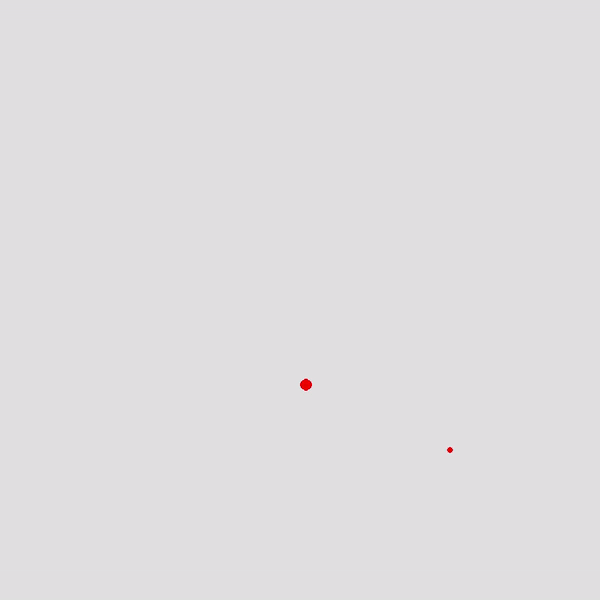

# Food-Seeking Ants - Neuro-evolutionary Model

1 month of coding, and in the last cycle, >6000 ants, but they finally learned to find food! 

## What is this?

This is my first attempt at writing a neural network from scratch, with no guides or tutorials. The concept is in the name; ants are moving creatures on the screen, which seek static 'food' items on the map. 

## How does it work?

Each ant moves constantly, but it can control the direction in which it moves. It's brain, the neural network, has 5 inputs: The x and y of the food, the x and y of itself, and the direction it is currently facing. From these 5 factors, it decides which direction it should move in next. 

Each generation, the top 10% of ants are copied to the next generation as is. The top 9% also get to pass their genes on to 10% of the next population as well, but with some variance. 

The best ants are calculated based on 3 factors. Most important is the amount of food each ant 'eats', but it also accounts for whether the ant is moving in the right direction, and how close the ant gets to the food. 

## What are the next major steps forwards? 

* Reduce the number of generations needed before progress (currently takes thousands)
* Calculate the ants' trajectory more accurately
	* Currently this only uses initial and final positions, which is inaccurate for non-linear paths
* Account for ants that pass near food in the selective process (?)
	* The idea is for ants that narrowly miss to be selected for over ants that miss by a lot
* Learn a better algorithm for selective process weighting (How much should each factor matter relative to each other?)
* The variance of each ant from its predecessor should decrease with time as their solutions get better (eg. MSE)

## References

* [Neural Networks and Deep Learning](http://neuralnetworksanddeeplearning.com/chap1.html) - a good tutorial for the basics
* [Pygame](https://www.pygame.org/) - an easy-to-use graphics system